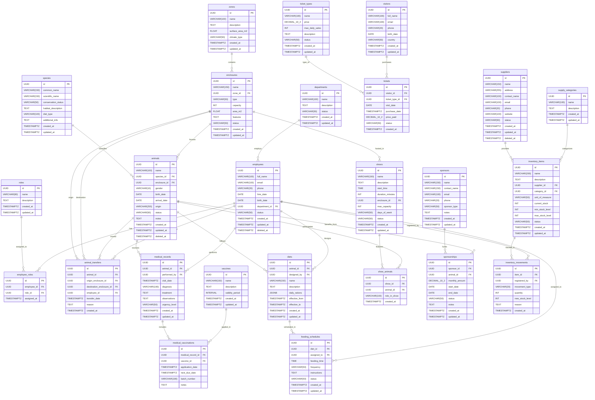

# Diagram

```mermaid
erDiagram
    departments {
        UUID id PK
        VARCHAR(100) name
        TEXT description
        VARCHAR(50) status
        TIMESTAMPTZ created_at
        TIMESTAMPTZ updated_at
    }

    roles {
        UUID id PK
        VARCHAR(80) name
        TEXT description
        TIMESTAMPTZ created_at
        TIMESTAMPTZ updated_at
    }

    employees {
        UUID id PK
        VARCHAR(100) full_name
        VARCHAR(100) email
        VARCHAR(20) phone
        DATE hire_date
        DATE birth_date
        UUID department_id FK
        VARCHAR(50) status
        TIMESTAMPTZ created_at
        TIMESTAMPTZ updated_at
        TIMESTAMPTZ deleted_at
    }

    employee_roles {
        UUID id PK
        UUID employee_id FK
        UUID role_id FK
        TIMESTAMPTZ assigned_at
    }

    species {
        UUID id PK
        VARCHAR(150) common_name
        VARCHAR(150) scientific_name
        VARCHAR(50) conservation_status
        TEXT habitat_description
        VARCHAR(100) diet_type
        TEXT additional_info
        TIMESTAMPTZ created_at
        TIMESTAMPTZ updated_at
    }

    zones {
        UUID id PK
        VARCHAR(100) name
        TEXT description
        FLOAT surface_area_m2
        VARCHAR(50) climate_type
        TIMESTAMPTZ created_at
        TIMESTAMPTZ updated_at
    }

    enclosures {
        UUID id PK
        VARCHAR(150) name
        UUID zone_id FK
        VARCHAR(50) type
        INT capacity
        FLOAT area_m2
        TEXT features
        VARCHAR(50) status
        TIMESTAMPTZ created_at
        TIMESTAMPTZ updated_at
    }

    animals {
        UUID id PK
        VARCHAR(100) name
        UUID species_id FK
        UUID enclosure_id FK
        VARCHAR(10) gender
        DATE birth_date
        DATE arrival_date
        VARCHAR(255) origin
        VARCHAR(50) status
        TEXT notes
        TIMESTAMPTZ created_at
        TIMESTAMPTZ updated_at
        TIMESTAMPTZ deleted_at
    }

    animal_transfers {
        UUID id PK
        UUID animal_id FK
        UUID origin_enclosure_id FK
        UUID destination_enclosure_id FK
        UUID employee_id FK
        TIMESTAMPTZ transfer_date
        TEXT reason
        TIMESTAMPTZ created_at
    }

    medical_records {
        UUID id PK
        UUID animal_id FK
        UUID performed_by FK
        TIMESTAMPTZ visit_date
        VARCHAR(100) diagnosis
        TEXT treatment
        TEXT observations
        VARCHAR(50) urgency_level
        TIMESTAMPTZ created_at
        TIMESTAMPTZ updated_at
    }

    vaccines {
        UUID id PK
        VARCHAR(150) name
        TEXT description
        INTERVAL validity_period
        TIMESTAMPTZ created_at
        TIMESTAMPTZ updated_at
    }

    medical_vaccinations {
        UUID id PK
        UUID medical_record_id FK
        UUID vaccine_id FK
        TIMESTAMPTZ application_date
        TIMESTAMPTZ next_due_date
        VARCHAR(100) batch_number
        TEXT notes
    }

    diets {
        UUID id PK
        UUID animal_id FK
        UUID designed_by FK
        VARCHAR(150) name
        TEXT description
        JSONB daily_rations
        TIMESTAMPTZ effective_from
        TIMESTAMPTZ effective_to
        TIMESTAMPTZ created_at
        TIMESTAMPTZ updated_at
    }

    feeding_schedules {
        UUID id PK
        UUID diet_id FK
        UUID assigned_to FK
        TIME feeding_time
        VARCHAR(50) frequency
        TEXT instructions
        VARCHAR(50) status
        TIMESTAMPTZ created_at
        TIMESTAMPTZ updated_at
    }

    ticket_types {
        UUID id PK
        VARCHAR(100) name
        DECIMAL_10_2 price
        INT max_daily_sales
        TEXT description
        VARCHAR(50) status
        TIMESTAMPTZ created_at
        TIMESTAMPTZ updated_at
    }

    visitors {
        UUID id PK
        VARCHAR(100) full_name
        VARCHAR(100) email
        VARCHAR(20) phone
        DATE birth_date
        VARCHAR(50) country
        TIMESTAMPTZ created_at
        TIMESTAMPTZ updated_at
    }

    tickets {
        UUID id PK
        UUID visitor_id FK
        UUID ticket_type_id FK
        DATE visit_date
        TIMESTAMPTZ purchase_date
        DECIMAL_10_2 price_paid
        VARCHAR(50) status
        TIMESTAMPTZ created_at
    }

    shows {
        UUID id PK
        VARCHAR(150) name
        TEXT description
        TIME start_time
        INT duration_minutes
        UUID enclosure_id FK
        INT max_capacity
        VARCHAR(50) days_of_week
        VARCHAR(50) status
        TIMESTAMPTZ created_at
        TIMESTAMPTZ updated_at
    }

    show_animals {
        UUID id PK
        UUID show_id FK
        UUID animal_id FK
        VARCHAR(100) role_in_show
        TIMESTAMPTZ created_at
    }

    sponsors {
        UUID id PK
        VARCHAR(150) name
        VARCHAR(150) contact_name
        VARCHAR(100) email
        VARCHAR(20) phone
        VARCHAR(50) sponsor_type
        TEXT notes
        TIMESTAMPTZ created_at
        TIMESTAMPTZ updated_at
    }

    sponsorships {
        UUID id PK
        UUID sponsor_id FK
        UUID animal_id FK
        DECIMAL_10_2 monthly_amount
        DATE start_date
        DATE end_date
        VARCHAR(50) status
        TEXT notes
        TIMESTAMPTZ created_at
        TIMESTAMPTZ updated_at
    }

    suppliers {
        UUID id PK
        VARCHAR(150) name
        VARCHAR(255) address
        VARCHAR(100) contact_name
        VARCHAR(100) email
        VARCHAR(20) phone
        VARCHAR(100) website
        VARCHAR(50) status
        TIMESTAMPTZ created_at
        TIMESTAMPTZ updated_at
        TIMESTAMPTZ deleted_at
    }

    supply_categories {
        UUID id PK
        VARCHAR(100) name
        TEXT description
        TIMESTAMPTZ created_at
        TIMESTAMPTZ updated_at
    }

    inventory_items {
        UUID id PK
        VARCHAR(200) name
        TEXT description
        UUID supplier_id FK
        UUID category_id FK
        VARCHAR(50) unit_of_measure
        INT current_stock
        INT min_stock_level
        INT max_stock_level
        VARCHAR(50) status
        TIMESTAMPTZ created_at
        TIMESTAMPTZ updated_at
    }

    inventory_movements {
        UUID id PK
        UUID item_id FK
        UUID registered_by FK
        VARCHAR(20) movement_type
        INT quantity
        INT new_stock_level
        TEXT reason
        TIMESTAMPTZ created_at
    }

    departments ||--o{ employees : "employs"
    roles ||--o{ employee_roles : "assigned_to"
    employees ||--o{ employee_roles : "has"
    species ||--o{ animals : "classifies"
    zones ||--o{ enclosures : "contains"
    enclosures ||--o{ animals : "houses"
    enclosures ||--o{ animal_transfers : "origin"
    enclosures ||--o{ animal_transfers : "destination"
    animals ||--o{ animal_transfers : "moved"
    employees ||--o{ animal_transfers : "authorized_by"
    animals ||--o{ medical_records : "receives"
    employees ||--o{ medical_records : "performs"
    medical_records ||--o{ medical_vaccinations : "includes"
    vaccines ||--o{ medical_vaccinations : "applied_in"
    animals ||--o{ diets : "follows"
    employees ||--o{ diets : "designs"
    diets ||--o{ feeding_schedules : "scheduled_in"
    employees ||--o{ feeding_schedules : "assigned_to"
    ticket_types ||--o{ tickets : "type_of"
    visitors ||--o{ tickets : "purchases"
    enclosures ||--o{ shows : "hosted_in"
    shows ||--o{ show_animals : "features"
    animals ||--o{ show_animals : "participates"
    sponsors ||--o{ sponsorships : "funds"
    animals ||--o{ sponsorships : "benefits_from"
    suppliers ||--o{ inventory_items : "provides"
    supply_categories ||--o{ inventory_items : "categorizes"
    inventory_items ||--o{ inventory_movements : "tracked_in"
    employees ||--o{ inventory_movements : "registered_by"
```
